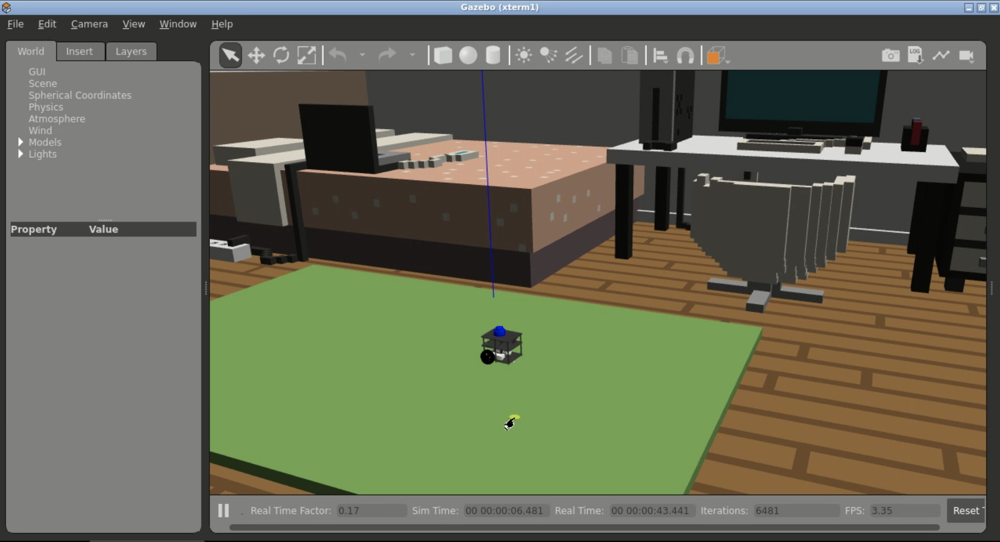
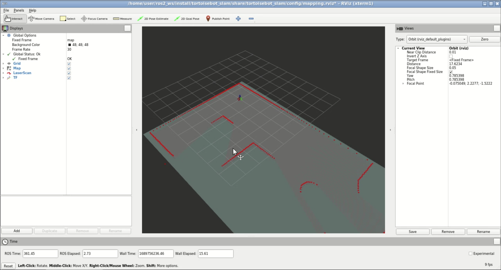

# Checkpoint 22 — Docker for Robotics (FastBot)

End-to-end **Docker + docker-compose** packaging of the **FastBot** ROS 2 stack — Gazebo simulation, Nav2 / Cartographer, rosbridge + nginx webapp, and **real-robot bringup** on the physical Raspberry Pi FastBot. Clone the repo, run `docker-compose up`, and the stack pulls pre-built images from `mathros/mathiasrosas-cp22` on Docker Hub — **no ROS 2 install on the host is required**.

<p align="center">
  
</p>

> **TL;DR** — install Docker Engine + Compose, `git clone`, `cd simulation && docker-compose up`. Browser hits the webapp on port `7000`, rosbridge on `9090`.

## Why containerize?

This repo is the deployment layer for the FastBot project: same ROS 2 code, same Nav2 config, same Vue dashboard, now reproducible in one `docker-compose up` — **host stays clean**, the exact same image runs on a developer laptop, a CI runner, or the real Raspberry Pi on the robot. The non-containerized source repos it packages are:

- [`mathrosas/fastbot_slam`](https://github.com/mathrosas/fastbot_slam) — ROS 2 stack (description, Cartographer, AMCL, Nav2, `tf2_web_republisher_py`) — this is the backend the `slam` and `gazebo` images are built from
- [`mathrosas/fastbot_webapp`](https://github.com/mathrosas/fastbot_webapp) — Vue.js dashboard served by the `webapp` image behind nginx

## Repository Layout

```
fastbot_ros2_docker/
├── simulation/                     3-container compose stack for Gazebo sim
│   ├── Dockerfile.nvidia_ros2     base image: nvidia/cuda + ROS 2 Humble + Gazebo
│   ├── Dockerfile.gazebo          builds fastbot_gazebo + fastbot_description
│   ├── Dockerfile.slam            builds fastbot_slam (Cartographer + Nav2)
│   ├── Dockerfile.webapp          nginx + rosbridge + tf2_web_republisher + web_video
│   ├── docker-compose.yaml        bridge-network wiring of the 3 services
│   └── entrypoint.sh              webapp entrypoint — brings up rosbridge + nginx
│
├── real/                           2-container compose stack for the physical robot
│   ├── Dockerfile.fastbot-ros2-real        bringup (camera, lidar, motors, serial)
│   ├── Dockerfile.fastbot-ros2-slam-real   SLAM + RViz against the real robot
│   ├── docker-compose.yaml                 host-network compose with Cyclone DDS
│   └── entrypoint.sh                       exports RMW/CYCLONEDDS_URI, sources overlay
│
├── fastbot/                        ROS 2 sources COPY'd into the sim/real images
│   ├── fastbot_description/       URDF + xacro + meshes
│   ├── fastbot_gazebo/            sim worlds + spawn launches
│   ├── fastbot_bringup/           real-robot camera + lidar + motors launch
│   ├── fastbot_slam/              Cartographer + Nav2 config + launches
│   ├── fastbot_gripper/           optional gripper stack
│   ├── serial_motor/              pyserial motor driver
│   ├── serial_motor_msgs/         msg package for the motor driver
│   └── docker/                    reference multi-stage Dockerfile + bringup volumes
│
├── fastbot_webapp/                 Vue.js dashboard (COPY'd into the webapp image)
│   ├── index.html, main.js, styles.css, libs/, fastbot_description/
│   └── nginx.conf                 reverse-proxy / → static, /rosbridge/ → 9090, /cameras/ → 11315
│
└── media/                          README screenshots
```

## The base image — `Dockerfile.nvidia_ros2`

Published as `mathros/mathiasrosas-cp22:nvidia_ros2` and used as the `FROM` for the heavy-weight Gazebo image. CUDA base so GPU rendering works when the host exposes a GPU; ROS 2 Humble desktop so Gazebo, xacro and RViz are all available in one layer.

```dockerfile
FROM nvidia/cuda:11.7.1-base-ubuntu22.04

RUN apt update && apt install -y locales lsb-release curl gnupg2
RUN locale-gen en_US en_US.UTF-8 && update-locale LC_ALL=en_US.UTF-8 LANG=en_US.UTF-8

# ROS 2 Humble APT source
RUN curl -sSL https://raw.githubusercontent.com/ros/rosdistro/master/ros.key \
      -o /usr/share/keyrings/ros-archive-keyring.gpg
RUN echo "deb [arch=$(dpkg --print-architecture) signed-by=/usr/share/keyrings/ros-archive-keyring.gpg] \
      http://packages.ros.org/ros2/ubuntu $(lsb_release -cs) main" \
      | tee /etc/apt/sources.list.d/ros2.list > /dev/null

RUN apt update && apt upgrade -y && apt install -y \
      ros-humble-desktop \
      ros-humble-gazebo-ros-pkgs \
      ros-humble-xacro \
      python3-colcon-common-extensions

RUN echo "source /opt/ros/humble/setup.bash" >> ~/.bashrc
```

The SLAM / webapp / real-robot images derive from `ros:humble-ros-base-jammy` (smaller, no GUI) instead.

## Simulation stack — `simulation/docker-compose.yaml`

Three-service compose on a shared `fastbot-network` bridge so intra-container DDS traffic stays private:

<p align="center">
  
</p>

```yaml
services:
  fastbot-ros2-gazebo:
    image: mathros/mathiasrosas-cp22:fastbot-ros2-gazebo
    command: ["source install/setup.bash && ros2 launch fastbot_gazebo one_fastbot_room.launch.py"]
    volumes: [/tmp/.X11-unix:/tmp/.X11-unix]   # X11 forwarding for gzclient / RViz
    environment: [DISPLAY=${DISPLAY}, ROS_DOMAIN_ID=0]
    privileged: true

  fastbot-ros2-slam:
    image: mathros/mathiasrosas-cp22:fastbot-ros2-slam
    command: ["sleep 20 && source install/setup.bash && ros2 launch fastbot_slam navigation.launch.py"]
    # `sleep 20` lets Gazebo publish /tf + /scan before Nav2 starts lifecycle activation

  fastbot-ros2-webapp:
    image: mathros/mathiasrosas-cp22:fastbot-ros2-webapp
    ports: ["7000:80", "9090:9090"]            # nginx (dashboard) + rosbridge
    volumes: [logs:/var/log/nginx]
```

### Container responsibilities

| Service | Image (Docker Hub) | Role |
|---|---|---|
| `fastbot-ros2-gazebo` | `mathros/mathiasrosas-cp22:fastbot-ros2-gazebo` | Gazebo 11 + FastBot URDF + `one_fastbot_room.launch.py` — publishes `/fastbot_1/odom`, `/fastbot_1/scan`, `/fastbot_1/cmd_vel`, `/fastbot_1/camera/image_raw` |
| `fastbot-ros2-slam` | `mathros/mathiasrosas-cp22:fastbot-ros2-slam` | `nav2_bringup` + `cartographer_ros` — runs `fastbot_slam/navigation.launch.py` (map_server + AMCL + planner + controller + BT + lifecycle_manager). Startup is gated by `sleep 20` so Gazebo publishes TFs first |
| `fastbot-ros2-webapp` | `mathros/mathiasrosas-cp22:fastbot-ros2-webapp` | nginx serving the Vue dashboard + `rosbridge_websocket` + `tf2_web_republisher` + `web_video_server` (all launched by `entrypoint.sh`) |

### Networking & ports

- `fastbot-network` (driver `bridge`) — `ROS_DOMAIN_ID=0` across all three services so they share a DDS discovery domain
- Host port `7000 → 80` — dashboard (`http://localhost:7000`)
- Host port `9090 → 9090` — rosbridge WebSocket (`ws://localhost:9090/`)
- `privileged: true` + `X11-unix` volume — lets `gzclient` / RViz render on the host X server
- `restart: always` — compose restarts any crashed service

### `Dockerfile.gazebo`

Two-line overlay on the pre-baked nvidia_ros2 base — just COPY the sim packages and `colcon build`:

```dockerfile
FROM mathros/mathiasrosas-cp22:nvidia_ros2
COPY ./fastbot/fastbot_gazebo       /ros2_ws/src/fastbot_slam
COPY ./fastbot/fastbot_description  /ros2_ws/src/fastbot_description
RUN source /opt/ros/humble/setup.bash && cd /ros2_ws && colcon build
WORKDIR /ros2_ws
```

### `Dockerfile.slam`

Switches to the leaner `ros:humble-ros-base-jammy` — no desktop tools, just Nav2 + Cartographer + RViz:

```dockerfile
FROM ros:humble-ros-base-jammy
RUN apt update && apt install -y \
    ros-humble-rviz2 ros-humble-nav2-msgs ros-humble-nav2-amcl \
    ros-humble-nav2-map-server ros-humble-nav2-planner ros-humble-nav2-bringup \
    ros-humble-nav2-bt-navigator ros-humble-cartographer-ros
COPY ./fastbot/fastbot_slam /ros2_ws/src/fastbot_slam
RUN source /opt/ros/humble/setup.bash && cd /ros2_ws && colcon build
```

### `Dockerfile.webapp` — the web bridge container

Nginx-backed single container that publishes the dashboard, the WebSocket bridge, **and** the MJPEG camera stream:

```dockerfile
FROM ros:humble-ros-base-jammy
RUN apt install -y nginx ros-humble-rosbridge-suite \
                   python3-pip python3-setuptools python3-wheel
RUN pip3 install pyquaternion

COPY ./fastbot_ros2_docker/simulation/entrypoint.sh   /entrypoint.sh
COPY ./fastbot_ros2_docker/fastbot_webapp             /var/www/html
COPY ./fastbot_ros2_docker/fastbot_webapp/nginx.conf  /etc/nginx/sites-available/
RUN ln -sf /etc/nginx/sites-available/nginx.conf /etc/nginx/sites-enabled/

ENTRYPOINT ["/bin/bash"]
CMD ["/entrypoint.sh"]
WORKDIR /var/www/html
```

The entrypoint script launches the three web-bridge processes in the background, then keeps `nginx` in the foreground so PID 1 pins container lifetime to the actual service:

```bash
source /opt/ros/humble/setup.bash
. /ros2_ws/install/setup.bash       # if an overlay exists

( ros2 run tf2_web_republisher tf2_web_republisher )     & sleep 2
( ros2 run web_video_server    web_video_server   --ros-args -p port:=11315 ) & sleep 2
( ros2 launch rosbridge_server rosbridge_websocket_launch.xml ) & sleep 2

nginx -t && exec nginx -g 'daemon off;'
```

And nginx reverse-proxies every browser concern through port 80:

```nginx
root /var/www/html;
location /            { try_files $uri $uri/ /index.html; }
location /rosbridge/  { proxy_pass http://127.0.0.1:9090/; proxy_http_version 1.1;
                        proxy_set_header Upgrade $http_upgrade; proxy_set_header Connection "upgrade"; }
location /cameras/    { proxy_pass http://127.0.0.1:11315/; proxy_buffering off; }
add_header Access-Control-Allow-Origin *;
```

So the dashboard only needs **one** exposed host port (`7000 → 80`) — `/rosbridge/`, `/cameras/`, and the static assets all flow through it.

## Real-robot stack — `real/docker-compose.yaml`

Runs on the physical Raspberry Pi FastBot (Ubuntu 24.04 server). Key differences vs. the sim compose:

| Concern | Sim | Real |
|---|---|---|
| Network | `fastbot-network` bridge | `network_mode: host` (direct access to the physical network's DDS traffic) |
| RMW | default Fast DDS | `RMW_IMPLEMENTATION=rmw_cyclonedds_cpp` + `CYCLONEDDS_URI=/var/lib/theconstruct.rrl/cyclonedds.xml` |
| Devices | — | `/dev/video0`, `/dev/lslidar`, `/dev/arduino_nano` mapped into the container |
| Commands | `ros2 launch fastbot_gazebo ...` | `ros2 launch fastbot_bringup bringup.launch.xml` + `ros2 launch fastbot_slam cartographer.launch.py` |

```yaml
fastbot-ros2-real:
  image: mathros/mathiasrosas-cp22:fastbot-ros2-real
  environment:
    - ROS_DOMAIN_ID=0
    - RMW_IMPLEMENTATION=rmw_cyclonedds_cpp
    - CYCLONEDDS_URI=/var/lib/theconstruct.rrl/cyclonedds.xml
  volumes:
    - /dev/video0:/dev/video0
    - /dev/lslidar:/dev/lslidar
    - /dev/arduino_nano:/dev/arduino_nano
    - ./entrypoint.sh:/entrypoint.sh
    - /var/lib/theconstruct.rrl/cyclonedds.xml:/var/lib/theconstruct.rrl/cyclonedds.xml
  privileged: true
  network_mode: host
  entrypoint: /entrypoint.sh
  command: ["ros2 launch fastbot_bringup bringup.launch.xml"]

fastbot-ros2-slam-real:
  image: mathros/mathiasrosas-cp22:fastbot-ros2-slam-real
  # same RMW + Cyclone config, + X11 for RViz
  command: ["sleep 8 && ros2 launch fastbot_slam cartographer.launch.py"]
```

The `real/Dockerfile.fastbot-ros2-real` pulls in the full sensor-driver stack:

```dockerfile
FROM ros:humble-ros-base-jammy
RUN apt install -y \
    python3-colcon-common-extensions python3-pip build-essential \
    libboost-all-dev libpcap-dev libpcl-dev v4l-utils \
    ros-humble-xacro ros-humble-tf2* ros-humble-joint-state-publisher \
    ros-humble-pcl-conversions ros-humble-pluginlib \
    ros-humble-diagnostic-updater ros-humble-v4l2-camera \
    ros-humble-image-transport-plugins ros-humble-rmw-cyclonedds-cpp
RUN pip install pyserial
COPY ./fastbot /ros2_ws/src/fastbot
RUN colcon build --symlink-install
```

And the `entrypoint.sh` for the real-robot image exports the DDS environment **before** sourcing the overlay and launching:

```bash
#!/bin/bash
set -e
export RMW_IMPLEMENTATION=rmw_cyclonedds_cpp
export CYCLONEDDS_URI=/var/lib/theconstruct.rrl/cyclonedds.xml
source "/opt/ros/$ROS_DISTRO/setup.bash"
source "/ros2_ws/install/setup.bash"
exec bash -c "$@"
```

## Pre-built images on Docker Hub

All five images are published under the same repo/tag namespace — compose pulls them on first run:

| Tag | Built from | Role |
|---|---|---|
| `mathros/mathiasrosas-cp22:nvidia_ros2` | `Dockerfile.nvidia_ros2` | CUDA + ROS 2 Humble Desktop base |
| `mathros/mathiasrosas-cp22:fastbot-ros2-gazebo` | `Dockerfile.gazebo` | Sim container |
| `mathros/mathiasrosas-cp22:fastbot-ros2-slam` | `Dockerfile.slam` | Nav2 + Cartographer container |
| `mathros/mathiasrosas-cp22:fastbot-ros2-webapp` | `Dockerfile.webapp` | nginx + rosbridge + web_video container |
| `mathros/mathiasrosas-cp22:fastbot-ros2-real` | `real/Dockerfile.fastbot-ros2-real` | Real-robot bringup (motors/lidar/camera) |
| `mathros/mathiasrosas-cp22:fastbot-ros2-slam-real` | `real/Dockerfile.fastbot-ros2-slam-real` | Real-robot SLAM + RViz |

## How to Use

### Prerequisites

- Docker Engine + Docker Compose (v1 `docker-compose` or v2 `docker compose`)

```bash
sudo apt-get update
sudo apt-get install -y docker.io docker-compose
sudo systemctl enable --now docker
sudo usermod -aG docker $USER && newgrp docker   # optional — run docker without sudo
```

### Simulation

```bash
git clone https://github.com/mathrosas/fastbot_ros2_docker.git
cd fastbot_ros2_docker/simulation
docker-compose up
```

Compose pulls the three images and starts them on the `fastbot-network` bridge. Verify from a second terminal:

```bash
docker ps
# fastbot-ros2-gazebo   …:fastbot-ros2-gazebo   Up …
# fastbot-ros2-slam     …:fastbot-ros2-slam     Up …
# fastbot-ros2-webapp   …:fastbot-ros2-webapp   Up …  0.0.0.0:9090->9090, 0.0.0.0:7000->80
```

Open a browser at:

- `http://localhost:7000` → the dashboard
- Paste `ws://localhost:9090/` (or the public URL from `rosbridge_address` in The Construct) in the ROSBridge field and click **Connect**
- You should see the occupancy map, 3D FastBot model, camera feed; drive with the joystick or click a waypoint button to trigger Nav2

Tear down:

```bash
docker-compose down      # from fastbot_ros2_docker/simulation
```

### Real robot

```bash
cd fastbot_ros2_docker/real
docker-compose up
```

From any machine on the same network (with ROS 2 + Cyclone DDS configured identically):

```bash
ros2 topic list
# /scan
# /camera/image_raw
# /fastbot/cmd_vel
# /odom  /tf  /tf_static ...
```

Teleop the real robot:

```bash
ros2 run teleop_twist_keyboard teleop_twist_keyboard \
  --ros-args --remap cmd_vel:=fastbot/cmd_vel
```

In RViz2 (launched by `fastbot-ros2-slam-real`):

- Click **2D Pose Estimate** to seed AMCL
- Click **2D Nav Goal** to send a NavigateToPose

### Tips & Troubleshooting

- **Compose v1 vs v2** — use `docker-compose` or `docker compose` depending on what's installed
- **Container won't start** — `docker-compose logs <service-name>` (e.g. `fastbot-ros2-slam`)
- **Stale `gzserver`** — after a hard Gazebo crash: `ps aux | grep gz && kill -9 <pid>`
- **USB / serial device permissions on the real robot** — make sure `/dev/ttyUSB*`, `/dev/arduino_nano`, `/dev/lslidar` are either mapped in `docker-compose.yaml` or `privileged: true` is set; the host user may also need membership in `dialout` / `video`
- **Autostart on reboot** — set `restart: always` in compose (already on all services) and ensure Docker auto-starts: `sudo systemctl enable docker`

## Companion repositories

Non-containerized source of the same robot stack:

- [`fastbot_slam`](https://github.com/mathrosas/fastbot_slam) (Checkpoint 21) — ROS 2 stack: URDF, Cartographer, AMCL, Nav2, `tf2_web_republisher_py`, `fastbot_topic_filter`
- [`fastbot_webapp`](https://github.com/mathrosas/fastbot_webapp) (Checkpoint 21) — Vue.js dashboard (roslibjs + ros3djs + ros2djs + mjpegcanvas)

## Key Concepts Covered

- **Multi-container ROS 2 topology** — one compose file per environment (sim vs. real), named DDS domain, shared bridge network for intra-sim and `network_mode: host` for the real robot
- **Layered custom base image** — `nvidia/cuda:11.7 + ROS 2 Humble Desktop + Gazebo` pre-baked as `nvidia_ros2` tag, then overlaid with package-specific Dockerfiles — minimises rebuild time and Docker Hub pulls
- **Multi-stage Dockerfiles** — `fastbot/docker/Dockerfile` uses a `build_stage` that clones + `colcon build`s, then copies only `/root/ros2_ws` into a slim runtime image
- **Nginx as the single web-facing port** — static SPA + WebSocket proxy (`/rosbridge/`) + MJPEG proxy (`/cameras/`) all behind `:80`, so the dashboard only needs one exposed port
- **Cyclone DDS for multi-host interop** — `RMW_IMPLEMENTATION=rmw_cyclonedds_cpp` + mounted `cyclonedds.xml` config lets the real-robot containers share a DDS domain with The Construct's network stack
- **Device passthrough** — `/dev/video0`, `/dev/lslidar`, `/dev/arduino_nano` bind-mounted into the bringup container so the ROS 2 drivers see the physical peripherals
- **X11 forwarding** — `/tmp/.X11-unix` bind + `DISPLAY` env so `gzclient` / RViz2 inside the container render on the host's X server
- **`restart: always` + entrypoint gating** — `sleep 20` in the SLAM container ensures Gazebo has published `/tf` and `/scan` before Nav2 lifecycle activation

## Technologies

- Docker Engine + Docker Compose (v1 and v2 compatible)
- Base images: `nvidia/cuda:11.7.1-base-ubuntu22.04`, `ros:humble-ros-base-jammy`
- ROS 2 Humble (Nav2, Cartographer, AMCL, `rosbridge_suite`, `tf2_web_republisher`, `web_video_server`)
- Gazebo 11 (sim), nginx (webapp), Cyclone DDS (real-robot interop)
- Vue.js dashboard served behind nginx (reverse-proxied rosbridge + MJPEG)
- FastBot — Raspberry Pi 4 + Arduino motor driver + LSLidar + Raspicam
